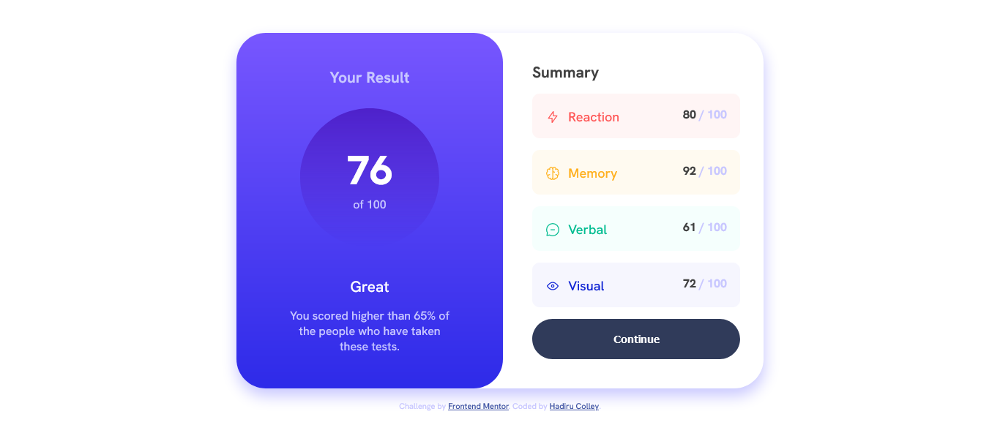

# Frontend Mentor - Results summary component solution

This is a solution to the [Results summary component challenge on Frontend Mentor](https://www.frontendmentor.io/challenges/results-summary-component-CE_K6s0maV). Frontend Mentor challenges help you improve your coding skills by building realistic projects.

## Table of contents

- [Overview](#overview)
  - [The challenge](#the-challenge)
  - [Screenshot](#screenshot)
  - [Links](#links)
- [My process](#my-process)
  - [Built with](#built-with)
  - [Useful resources](#useful-resources)
- [Author](#author)

**Note: Delete this note and update the table of contents based on what sections you keep.**

## Overview

### The challenge

Users should be able to:

- View the optimal layout for the interface depending on their device's screen size
- See hover and focus states for all interactive elements on the page

### Screenshot

### Links

- Solution URL: [Add solution URL here](https://your-solution-url.com)
- Live Site URL: [Add live site URL here](https://your-live-site-url.com)

## My process

Variable Declarations:
Declare CSS variables using the :root selector to define primary colors, neutral colors, gradient colors, font styles, and font sizes.

Global Styles:
Set global styles using selectors such as html, body, and \* to define box-sizing, font-family, font-size, color, and background-color.

Component Styles:

      Style the .main__container element:
          Set display to flex and flex-direction to column to create a vertical layout.
          Set min-height to fit-content to allow the container to expand based on its contents.

      Style the .result-wrapper element:
          Apply a background gradient using the background property and linear-gradient() function.
          Use grid layout with display: grid to arrange the child elements.
          Define padding, border-radius, and text alignment properties.

      Style the .circle element:
          Set margin, padding, and border-radius properties to create a circular shape.
          Use flexbox properties to center the child elements.
          Apply a gradient background using the background property and linear-gradient() function.

      Style the .percent and .btm elements within .circle:
          Define font size, color, and font-weight properties.

      Style the .text-container element within .result-wrapper:
          Set padding and font properties.
          Adjust font color for specific elements.

      Style the .summary-wrapper element:
          Define padding and gap properties.
          Use grid layout with display: grid to arrange the child elements.

      Style the .summary-item elements within .summary-wrapper:
          Set padding, border-radius, and background-color based on specific areas.
          Use flexbox properties to align the child elements.
          Apply custom icons using the content property and url() function.

      Style the .summary-wrapper button:
          Set padding, border-radius, background-color, font-weight, color, and other properties.
          Define hover and active states using pseudo-classes.

      Apply media queries to adjust styles for different screen sizes:
          Use @media rule with min-width condition to target screens larger than 560px.
          Adjust the layout, sizing, and spacing of elements accordingly.

Attribution Styles:
Style the .attribution and .attribution a elements to define font size, text alignment, and color.

### Built with

- Semantic HTML5 markup
- CSS custom properties
- Flexbox
- CSS Grid
- Mobile-first workflow

### Useful resources

- [freecodecamp](https://www.freecodecamp.org/news/web-layouts-use-css-grid-and-flex-to-create-responsive-webpages/) - This helped me understood grid layout and the relationship between parent and children elements in a grid. I'd recommend it to anyone still learning this concept.

## Author

- Frontend Mentor - [@dirudeen](https://www.frontendmentor.io/profile/dirudeen)
- Twitter - [@deenboi22](https://www.twitter.com/deenboi22)
